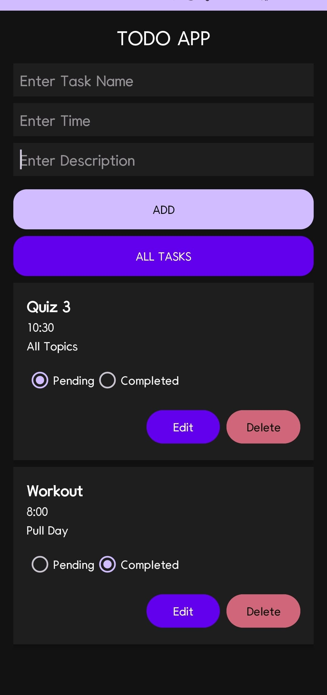

# TodoAppJava

This is a Java-based todo application that helps you manage your daily tasks efficiently.

## Preview



## Features

- **Task Management**: Add, edit, and delete tasks.
- **Priority Setting**: Assign priorities to tasks.
- **Due Dates**: Set due dates for tasks.
- **Task Completion**: Mark tasks as completed.
- **Persistent Storage**: Tasks are saved between sessions.

## Technologies Used

- **Java**: Core programming language.
- **Swing**: For building the user interface.
- **JDBC**: For database connectivity.
- **SQLite**: Used as the database for storing tasks.

## Installation

To run the project locally:

1. Clone the repository:
   ```bash
   git clone https://github.com/Saqibb786/TodoAppJava.git
   ```

## Contributing 🤝

We welcome contributions from everyone. If you'd like to contribute, please fork the repository and create a pull request.

1. **Fork the repository**
2. **Create a new branch**: `git checkout -b feature/your-feature-name`
3. **Commit your changes**: `git commit -m 'Add some feature'`
4. **Push to the branch**: `git push origin feature/your-feature-name`
5. **Open a pull request**

## License 📄

This project is licensed under the MIT License - see the [LICENSE](LICENSE) file for details.
